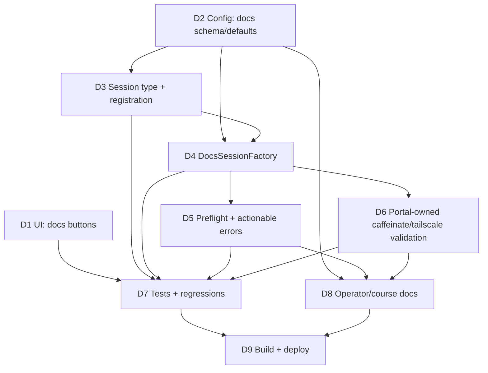

# Extension: Docs Action via fea-docs

## Problem Statement

The workspace portal currently provides two per-directory launch actions: OpenCode and VS Code. There is no first-class way to spin up a documentation app for a directory from the same UI.

You recently published `fea-docs`, which can generate and serve a docs app from existing Markdown/MDX content. Today that flow still requires dropping to a shell and manually invoking the CLI per project.

This creates a gap in the portal's core value proposition: one-tap, per-directory, remote lifecycle control for development tooling.

## Solution

Add a third action button, labeled exactly `docs`, on every directory row (including the workspace root row), alongside existing OpenCode and VS buttons.

When clicked, the portal starts a new session type (`docs`) for that directory using `fea-docs` through `npx`, with the assigned portal-managed port. Docs sessions follow the same lifecycle model as other session types: start, health-check, dedupe, list in running sessions, open, stop, persist, and recover.

The portal remains the source of truth for sleep resilience and network exposure:

- Use existing portal-managed caffeinate behavior (service/session strategy)
- Use existing portal-managed tailscale registration flow
- Do not delegate those concerns to `fea-docs` CLI flags

## User Stories

1. As a portal user, I want a `docs` button on every directory row, so I can launch documentation for any project with one tap.
2. As a portal user, I want the workspace root row to also include `docs`, so root-level docs can be launched the same way as nested projects.
3. As a portal user, I want docs sessions to allocate ports automatically from a dedicated range, so docs traffic does not contend with OpenCode or VS Code ranges.
4. As a portal user, I want docs launches to dedupe by directory, so repeated clicks do not spawn duplicate docs servers.
5. As a portal user, I want running docs sessions to appear in the existing sessions list with open/stop actions, so lifecycle management is consistent.
6. As a portal user, I want startup failures to be actionable (for example, missing `node` or `npx`), so I can fix environment issues quickly.
7. As a maintainer, I want fea-docs package versioning pinned (not `@latest`), so deployments are reproducible and stable.
8. As a maintainer, I want known fea-docs content mutation behavior documented (auto frontmatter title injection), so repo-side effects are explicit.

## Acceptance Criteria

1. Every rendered directory row includes a new action button labeled `docs` next to OpenCode and VS.
2. The synthetic workspace root row also includes the `docs` button.
3. Clicking `docs` sends `POST /sessions/start` with `type=docs` and the row directory path.
4. A new session type `docs` is supported end-to-end in session manager registration and lifecycle.
5. Docs sessions are deduped by `(type=docs, dir)` exactly like existing per-type/per-dir dedupe semantics.
6. Docs sessions use a dedicated configurable port range, separate from OpenCode and VS Code ranges.
7. Docs session start command uses `npx` with a pinned `fea-docs` package version and passes the assigned port.
8. The implementation does not pass `--caffeinate` or tailscale exposure flags to `fea-docs`; portal-level mechanisms remain authoritative.
9. If docs startup fails due to missing runtime prerequisites (`node`/`npx`), the portal returns a clear, actionable start error in the existing error UX.
10. Running docs sessions appear in the existing sessions list and support open/stop flows unchanged.
11. Existing OpenCode and VS Code behavior remains unchanged.
12. Tests cover button rendering, start flow, session typing, dedupe, port allocation constraints, and actionable prerequisite failure handling.
13. Operator-facing docs are updated to describe docs-session config, runtime prerequisites, and known content mutation behavior.
14. Docs sessions use a longer configurable health startup timeout (default 120 seconds) so first-run fea-docs bootstrap is not prematurely marked failed.

## Implementation Decisions

- Add `SessionTypeDocs = "docs"`.
- Add a `DocsSessionFactory` that executes `npx --yes <pinned-fea-docs-package> start --port <port>` with `cmd.Dir = <target dir>`.
- Preflight runtime prerequisites before spawn, with explicit failure messages for missing `node`/`npx`.
- Keep startup and health semantics aligned with existing session factories (`waitHealthy`, SSE lifecycle events, stop behavior).
- Add a new config section (for example `docs.binary`, `docs.package`, `docs.port_range`), where package must be pinned to a specific version (no `@latest`).
- Add docs health startup timeout configuration (`docs.health_startup_timeout`) with default `120` seconds.
- Keep tailscale registration and URL publication inside the existing manager+registrar flow.
- Keep caffeinate strategy in the portal process/session layer only; do not rely on `fea-docs` caffeinate flags.
- Preserve current HTML/HTMX flow by extending existing templates and request payloads rather than introducing new endpoints.
- Document and accept fea-docs content-side behavior that may inject missing frontmatter titles into scanned docs files.

## Testing Decisions

- **Server rendering tests**
  - Verify `docs` button is present for normal tree rows.
  - Verify `docs` button is present on root row.
  - Verify `POST /sessions/start` receives and routes `type=docs`.
- **Session manager tests**
  - Verify unknown type still errors, and `docs` type is accepted when registered.
  - Verify dedupe for `(docs, dir)` returns existing session.
  - Verify docs ports are allocated from docs range and do not collide with existing in-use ports.
- **Factory tests**
  - Verify docs command shape and argument ordering include pinned package and `--port`.
  - Verify preflight failure returns actionable error text when `node`/`npx` is unavailable.
  - Verify no fea-docs tailscale/caffeinate flags are injected by default.
  - Verify docs factory exposes extended startup timeout value.
- **Regression tests**
  - Existing OpenCode/VS start flows remain green.
  - Existing sessions list rendering and stop behavior remain unchanged.

## Out of Scope

- Automatic detection of whether a directory "contains docs" before showing the button.
- Delegating tailscale or caffeinate ownership to fea-docs CLI flags.
- Multi-docs-session variants per directory (for example separate profiles) in this iteration.
- New auth model for docs sessions beyond existing portal/network boundaries.
- Script-runner unification or generic "custom command" launch surface.

## Further Notes

- This extension is intentionally additive and should not change user workflows for OpenCode or VS Code.
- Pinned fea-docs version should be updated deliberately through normal dependency-change review.
- Operator docs should include a quick checklist: node version, npx availability, docs port range, and expected mutation behavior.

## Vertical Slice Issues (Drafts)

### 1) UI Surface: Add `docs` Action Button to Tree Rows

**Type:** AFK  
**Blocked by:** None  
**User stories covered:** 1, 2

Add `docs` action button rendering for both standard directory rows and root row, wiring existing HTMX start flow with `type=docs`.

### 2) Session Domain: Introduce `docs` Session Type + Registration

**Type:** AFK  
**Blocked by:** None  
**User stories covered:** 3, 4, 5

Add `SessionTypeDocs`, manager registration, and dedicated docs port range wiring in config/server composition.

### 3) Runtime: Implement `DocsSessionFactory` with Pinned fea-docs

**Type:** AFK  
**Blocked by:** 2) Session Domain: Introduce `docs` Session Type + Registration  
**User stories covered:** 3, 6, 7

Implement docs process launch via `npx` using a pinned fea-docs package, include prerequisite preflight errors, and keep lifecycle behavior consistent.

### 4) Reliability Integration: Preserve Portal-Owned Caffeinate/Tailscale

**Type:** AFK  
**Blocked by:** 3) Runtime: Implement `DocsSessionFactory` with Pinned fea-docs  
**User stories covered:** 5

Ensure docs sessions rely on existing manager/registrar/caffeinate patterns and do not pass fea-docs ownership flags for those concerns.

### 5) Test and Docs Coverage for Docs Sessions

**Type:** AFK  
**Blocked by:** 1), 2), 3), 4)  
**User stories covered:** 6, 8

Add/extend automated tests and operator documentation for config, prerequisites, known side effects, and regression guarantees.

## Implementation Plan: Tickets and Dependency Graph

### Ticket Overview

| Ticket | Title | Type | Blocked By | Delivers |
|---|---|---|---|---|
| D1 | Add `docs` button to directory and root rows | AFK | None | UI surface and start payload wiring |
| D2 | Add docs config schema and defaults | AFK | None | Dedicated docs runtime config and port range |
| D3 | Add `SessionTypeDocs` and manager registration | AFK | D2 | Session-domain support for docs lifecycle |
| D4 | Implement `DocsSessionFactory` (`npx` + pinned package) | AFK | D2, D3 | Process launch, stop, health URL for docs sessions |
| D5 | Add prerequisite preflight and actionable startup errors | AFK | D4 | Clear failure UX for missing `node`/`npx` |
| D6 | Validate portal-owned caffeinate/tailscale behavior for docs | AFK | D4 | Confirms no fea-docs ownership flags; preserve registrar/caffeinate patterns |
| D7 | Add and update tests (server, manager, factory, regressions) | AFK | D1, D3, D4, D5, D6 | Automated confidence for new behavior and non-regression |
| D8 | Update operator/course docs for docs sessions | AFK | D2, D5, D6 | Configuration, prerequisites, and side-effect documentation |
| D9 | Build and deploy updated portal | AFK | D7, D8 | Production-ready binary deployed and service reloaded |

### Ticket Details

#### D1 - Add `docs` button to directory and root rows

**Scope**
- Update `internal/assets/templates/tree-row.html` to add a third action button labeled exactly `docs`.
- Update root-row rendering in `internal/assets/templates/layout.html` with matching `docs` button.
- Keep existing HTMX start flow (`POST /sessions/start`) and payload format, adding `type=docs`.

**Acceptance checks**
- `docs` button appears next to OpenCode and VS for every row.
- Root row also includes `docs`.
- Existing OpenCode/VS button behavior remains unchanged.

#### D2 - Add docs config schema and defaults

**Scope**
- Extend `internal/config/config.go` with docs config block (for example `DocsConfig`).
- Add defaults for:
  - docs launcher binary (default `npx`)
  - pinned package spec (default pinned `fea-docs@<version>`)
  - dedicated docs port range (`4300-4399`)
- Add env/yaml tags and validation so docs package is pinned (reject `@latest`).
- Add docs health startup timeout config with default `120` seconds.

**Acceptance checks**
- Config loads docs settings from YAML and env overrides.
- Defaults are applied when omitted.
- Invalid package spec (for example `@latest`) fails validation with clear error.
- Invalid docs health timeout (<= 0) fails validation with clear error.

#### D3 - Add `SessionTypeDocs` and manager registration

**Scope**
- Add `SessionTypeDocs` constant in `internal/session/session.go`.
- Register docs session factory in `internal/server/server.go` using docs port range.
- Ensure manager dedupe semantics naturally apply for `(type=docs, dir)`.

**Acceptance checks**
- `POST /sessions/start` accepts `type=docs` and routes to manager start.
- Duplicate starts for same dir and type return existing session.
- Unknown type behavior remains unchanged.

#### D4 - Implement `DocsSessionFactory` (`npx` + pinned package)

**Scope**
- Add `internal/session/docs.go` implementing `SessionFactory`.
- Start command format:
  - ``npx --yes <pinned-fea-docs-package> start --port <port>``
- Set `cmd.Dir` to selected directory.
- Route stdout/stderr to logger consistent with existing factories.
- Keep standard stop and health URL semantics.
- Provide a docs-specific startup health timeout value so manager can wait longer during first-run fea-docs bootstrap.

**Acceptance checks**
- Launched command contains pinned package and assigned port.
- No fea-docs tailscale/caffeinate ownership flags are added.
- Process lifecycle mirrors existing session factories.
- Docs startup timeout defaults to 120 seconds unless overridden in config.

#### D5 - Add prerequisite preflight and actionable startup errors

**Scope**
- Add preflight checks in docs factory for required runtime (`node`, `npx` availability).
- Return explicit errors with fix guidance when prerequisites are missing.
- Ensure existing `sessions-error.html` path surfaces this message without new endpoint work.

**Acceptance checks**
- Missing prerequisite yields actionable, user-visible error.
- Successful environments launch unchanged.
- Error messaging does not regress existing start errors.

#### D6 - Validate portal-owned caffeinate/tailscale behavior for docs

**Scope**
- Ensure docs sessions still use manager registrar flow for URLs/registration.
- Keep session-level caffeinate behavior aligned with existing model (portal-owned).
- Verify docs launch command intentionally omits fea-docs ownership flags.

**Acceptance checks**
- Tailscale URL publication behaves consistently with existing session types.
- Sleep resilience behavior remains controlled by portal strategy.
- No duplicated ownership behavior introduced.

#### D7 - Add and update tests (server, manager, factory, regressions)

**Scope**
- `internal/server/handlers_test.go`: assert docs button render and start handling.
- `internal/config/config_test.go`: docs defaults/env/validation cases.
- `internal/session/*_test.go`:
  - docs session type acceptance
  - dedupe semantics
  - docs port range behavior
  - docs command shape and preflight error behavior
- Regression assertions for OpenCode/VS unaffected behavior.

**Acceptance checks**
- New tests pass and meaningfully cover docs extension requirements.
- Existing tests remain green.

#### D8 - Update operator/course docs for docs sessions

**Scope**
- Update course/operator docs (deployment/config sections) to include:
  - docs config keys and defaults
  - Node/NPX prerequisites
  - pinned fea-docs package strategy
  - known content mutation behavior (frontmatter title injection)
  - quick verification steps

**Acceptance checks**
- Docs clearly explain setup and expected behavior.
- Troubleshooting includes missing runtime prereq guidance.

#### D9 - Build and deploy updated portal

**Scope**
- Build the updated binary after all code and docs changes are complete.
- Deploy the binary using the repository's deployment flow.
- Restart the launchd service so the new binary and behavior are active (for example `launchctl unload ~/Library/LaunchAgents/com.workspace-portal.plist` then `launchctl load -w ~/Library/LaunchAgents/com.workspace-portal.plist`).
- Verify service health and smoke-test docs action startup from the running portal.

**Acceptance checks**
- Build succeeds with no compile errors.
- Deploy command completes successfully (for example `make deploy`).
- Launchd service restart succeeds and `launchctl list` confirms the workspace-portal agent is running with the updated binary.
- Portal UI shows the `docs` button and can start at least one docs session successfully.
- Existing OpenCode and VS actions still function after deployment.

**Runbook (command order)**
- Build and deploy binary:
  - `make deploy`
- Restart launchd agent:
  - `launchctl unload ~/Library/LaunchAgents/com.workspace-portal.plist`
  - `launchctl load -w ~/Library/LaunchAgents/com.workspace-portal.plist`
- Verify launchd status:
  - `launchctl list | grep workspace-portal`
- Verify portal is reachable:
  - `curl -sf http://127.0.0.1:4000/ >/dev/null && echo "portal up"`
- Smoke test UI/session behavior:
  - Confirm `docs` button appears on root row and regular directory rows.
  - Start one docs session and verify it appears in Running Sessions.
  - Confirm OpenCode and VS session start/stop still work.

### Dependency Graph

### Suggested Execution Order

1. D2 (config contract)
2. D3 (session domain wiring)
3. D4 (factory runtime)
4. D5 (preflight UX)
5. D6 (ownership constraints)
6. D1 (UI exposure)
7. D7 (tests and regressions)
8. D8 (operator docs)
9. D9 (build and deploy)
